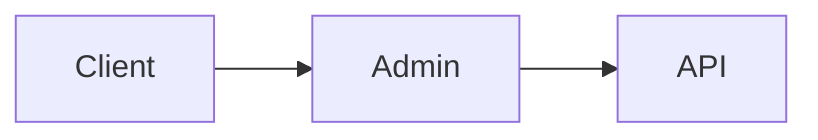

# Ecommerce Admin Sample

## 샘플 구성
- 이커머스 어드민 
  - Port: 8081
- 주문 도메인 API 
  - Port: 8082

## Service Flow


## Admin 계정 등록
- http://localhost:8081/users/register

# Concept
서비스 개선의 컨셉 단계

## Phase 0
초기 데이터베이스 사용 단계
```mermaid
User --> Admin --> Database
```

## Phase 1
API 연동하는 단계
```mermaid
User --> Admin --> O1(Order API)
```

## Phase 2
Gateway를 이용해서 API 연동하는 단계
```mermaid
User --> Admin --> Gateway --> O1(Order API)
```